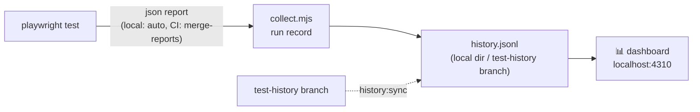

# 🎭 Playwright Practice Hub

[](LICENSE)
[](https://github.com/sumith97/playwright-practice-hub/actions/workflows/ci.yml)

A deliberately testable, full-stack web application where **Test Automation Engineers practice Playwright** against a realistic target — from your first `getByRole` to WebSocket frames, `storageState` sessions, `page.clock` time travel and Page Object architecture.

Every challenge page states the task, lists the Playwright concepts it teaches, gives progressive hints, and links to a **runnable reference test** in [`examples/`](examples/). The reference suite runs against the app on every change — that is what keeps every challenge provably solvable.

## What makes it different

- **46 challenges across 5 tracks** — basic, intermediate, advanced, expert and real-world — mapped explicitly to the official Playwright feature surface (locators, auto-wait, `page.route`, `storageState`, `page.clock`, tracing, sharding, `addLocatorHandler`, HAR…).
- **A real backend** (Fastify): practice `request`-fixture API testing, JWT auth with MFA, uploads/downloads, WebSockets and SSE — not just UI clicks.
- **Chaos Mode**: a global toggle that injects latency and DOM re-mounts so you learn to write tests that survive real-world flakiness.
- **Progress tracking** in localStorage — which is itself a storage-assertion challenge.
- **Dogfooded**: ~120 reference tests run in CI across Chromium, Firefox and WebKit.

## Quick start

```bash
npm install                 # installs workspaces (apps/web, apps/api) + tooling
npx playwright install      # downloads the three browser engines

npm run dev                 # starts web (5173) + api (3001) together
```

Open **http://localhost:5173** and pick a challenge. To write your own tests against it:

```bash
npm init playwright@latest  # in a separate folder (or reuse this repo's config)
# set baseURL to http://localhost:5173 and start solving
```

Or run the shipped reference suite (it boots both servers itself):

```bash
npm run test:examples       # Chromium
npm run test:examples:all   # Chromium + Firefox + WebKit
```

## Repository layout

```
├─ apps/
│  ├─ web/        # Vite + React + TS — the practice target SPA
│  │  └─ src/challenges/   # one folder per challenge (component + metadata)
│  └─ api/        # Fastify practice API (auth, CRUD, WS, SSE, uploads)
├─ examples/      # reference Playwright suites, one file per challenge
│  ├─ basic/  intermediate/  advanced/  shop/
│  └─ utils.ts    # loginViaApi, seedSession, reset helpers
├─ docs/          # challenge catalog + API reference
├─ playwright.config.ts     # 3 browser projects, webServer auto-start
└─ .github/workflows/ci.yml # sharded CI with trace artifacts
```

## The curriculum

### 🟢 Basic — foundations (6)
| # | Challenge | Concepts |
|---|---|---|
| 1 | [Locator Gym](/basics/locator-gym) | role / label / placeholder / text / testid / CSS / XPath locators, strict mode |
| 2 | [Actions Playground](/basics/actions-playground) | click, dblclick, right-click, hover, press, check, selectOption, focus/blur |
| 3 | [Form Validation](/basics/form-validation) | fill, disabled/enabled assertions, inline error messages |
| 4 | [Assertions Zoo](/basics/assertions-zoo) | toHaveText/Value/Count/Attribute/Class/URL/Title, visibility |
| 5 | [Navigation Wizard](/basics/navigation-wizard) | client-side routes, waitForURL, goBack, redirects |
| 6 | [First E2E Test](/basics/first-e2e) | the login → dashboard → logout skeleton |

### 🟡 Intermediate — real UI (12)
Waits & auto-waiting · Dynamic content (infinite scroll, polling) · Dropdowns & typeahead · Data tables (sort/filter/paginate) · iFrames · Windows & popups · Dialogs · Drag & drop (incl. canvas) · Files (upload/download) · Network inspection (`page.route`, `waitForResponse`) · Toasts · Clipboard & selection.

### 🔴 Advanced — professional grade (14)
Auth & sessions (JWT + MFA + `storageState`) · API testing (`request` fixture, full error matrix) · Mocking & HAR · WebSockets & SSE · Shadow DOM · Visual testing (masking, baselines) · Clock & timers (`page.clock`) · Storage & cookies · Emulation (geolocation, devices, locale, timezone) · A11y & aria snapshots · Flakiness clinic · Parallelism & sharding · Debugging & tracing · **Capstone: POM & custom fixtures** (a complete e-commerce shop).

### 🟣 Expert — modern Playwright (7)
**Setup project & `storageState`** (the canonical auth architecture, wired into this repo's config) · HAR record & replay · Overlay clinic (`page.addLocatorHandler`) · Console & page-error monitoring (auto fixture policy) · `test.step`, attachments & programmatic tracing · Network surgery (`route.fetch` patching, `{ times }`, `route.fallback`) · Worker-scoped fixtures & parallel-safe data.

### 🔵 Real World — the job itself (7)
**Analytics & tracking verification** (network spies + `exposeBinding`) · **Multi-user contexts** (two browser identities talking live) · **Keyboard navigation & focus** (skip links, roving tabs, modal traps) · **Custom matchers & soft assertions** (`expect.extend`) · **Performance smoke testing** (budgets, resource entries, `page.metrics()`) · **Kata: fix this bad test** (a deliberately awful suite to refactor) · **Config layering & environments** (feature-flag matrices, annotations, layered configs — see `playwright.smoke.config.ts`).

See [`docs/challenge-catalog.md`](docs/challenge-catalog.md) for the full table with links, [`docs/api-reference.md`](docs/api-reference.md) for endpoint details, and [`docs/architecture.md`](docs/architecture.md) for Mermaid diagrams of the system.

## The practice API

Real HTTP, same-origin with the SPA (the Vite dev server proxies `/api`, `/auth`, `/ws`, `/sse`):

- `POST /auth/login` — JWT. Demo users: `standard@demo.io` / `secret123`, `admin@demo.io` / `admin123`
- `GET|POST|PUT|DELETE /api/articles` — CRUD with 400/401/404/409 paths
- `POST /api/orders`, `GET /api/products` — the shop capstone
- `GET /api/slow?ms=`, `/api/flaky`, `/api/limited` — timing, retry and 429 practice
- `POST /api/upload`, `GET /api/files/:name/download` — multipart + downloads
- `WS /ws/chat`, `GET /sse/ticker` — realtime
- `POST /api/reset` — restore seed data for per-test isolation

Full reference: [`docs/api-reference.md`](docs/api-reference.md) or the in-app `/api-docs` page.

## Using this to teach or self-study

1. Run the app, open a challenge, read only the task.
2. Write a test for it in your own suite.
3. Stuck? Reveal hints one at a time.
4. Done? Compare with the reference test in `examples/` — and try to make yours cleaner.

Turn on **Chaos Mode** (header toggle) to replay any challenge under injected latency and re-mounts.

## Scripts

| Command | What it does |
|---|---|
| `npm run dev` | web + api together |
| `npm run dev:web` / `dev:api` | just one of them |
| `npm run build` | production build of the SPA |
| `npm run typecheck` | TS check of the web app |
| `npm run test:examples` | reference suite, Chromium |
| `npm run test:examples:all` | reference suite, all three engines |
| `npm run report` | browse the latest HTML report at localhost:9323 |

## Reports

**Every run produces a report.**

- **Local:** each test run writes an interactive HTML report to `playwright-report/` (it auto-opens in your browser only when something fails). View the latest one any time with `npm run report`.
- **CI:** each of the 3 shards emits a blob report; a `report` job merges them into a single HTML report, uploaded as the `playwright-report` artifact on every run (even red ones) — download it from the run's **Artifacts** section and open with `npx playwright show-report <unzipped-folder>`. The run page also shows a results table (passed/failed/flaky/skipped + duration) in the job summary, and failures get inline PR annotations plus trace/video artifacts for debugging.
- Failure traces and videos are always retained for 7 days; the merged report for 14.

## Test history & analysis dashboard

Every run — local and CI — can be recorded into an append-only history store, with a dashboard for trend analysis.



- **Every local run** automatically writes `test-history/last-run.json`. Add it to the history with `npm run history:record` (or the dashboard button) — so throwaway debug runs don't pollute trends.
- **Every CI run** is recorded automatically: the `report` job appends the run record to the `test-history` branch (dedup by run id, so re-runs don't duplicate).
- **`npm run dashboard`** starts the analysis dashboard at http://localhost:4310 — pass-rate and duration trends, per-run outcomes, flakiest and slowest test rankings, and recent runs with links to the CI run. `Sync from CI` (or `npm run history:sync`) merges the branch history into your local store.

Records are compact JSONL (totals + per-test rows), so the store is diff-friendly and scales to thousands of runs.

## Contributing

Broken challenge? Missing concept? PRs welcome — see [CONTRIBUTING.md](CONTRIBUTING.md) for the setup guide and the one hard rule: **every challenge ships with a green reference test.**

## License

[MIT](LICENSE) — use it, fork it, teach with it.
