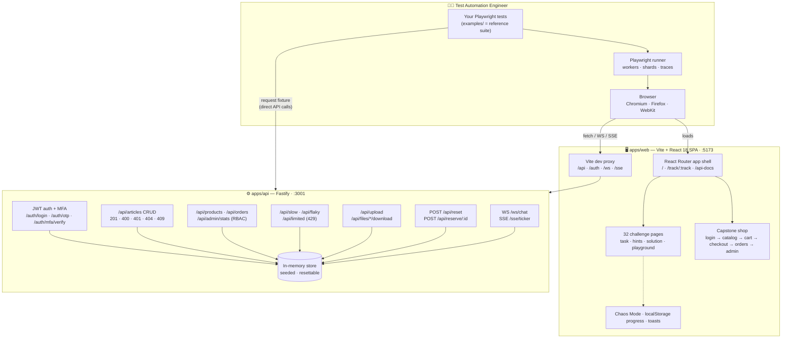
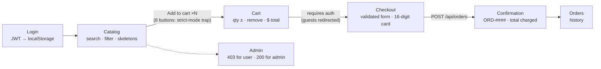
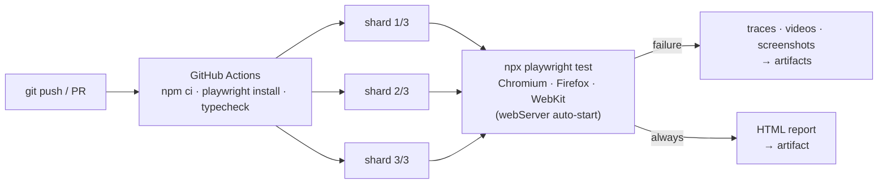

# Architecture

Diagrams render natively on GitHub. Sources of truth: `apps/web`, `apps/api`, `examples/`, `.github/workflows/ci.yml`.

## 1. System architecture

The test suite talks to the app twice: once through the **browser** (UI
interactions) and once **directly** via the `request` fixture (auth and API
testing challenges). Everything the API serves comes from one **resettable
in-memory store**, which makes per-test isolation a single `POST /api/reset`.

## 2. Capstone shop flow (the POM practice target)

## 3. CI pipeline

